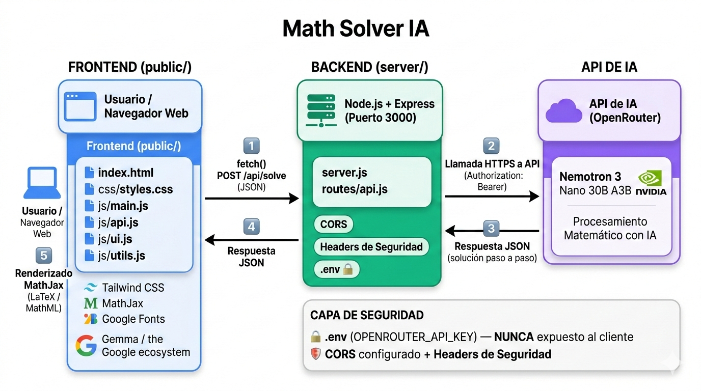

# 🧠 Math Solver IA

Aplicación web interactiva para resolver problemas matemáticos paso a paso usando inteligencia artificial, con soporte tanto para texto como para imágenes.

---

## 🚀 Descripción

**Math Solver IA** te ayuda a entender y resolver problemas matemáticos complejos, mostrando el proceso paso a paso en lugar de solo dar la respuesta final.

Puedes:

- Escribir el problema en texto (por ejemplo, una ecuación o un límite).
- Subir una imagen del enunciado (foto, captura de pantalla, etc.).
- Ver la solución renderizada con LaTeX y explicaciones claras.

La app utiliza modelos de IA especializados para matemáticas y visión, y un backend propio que protege tus claves de API.

---

## ✨ Características

- **Resolución paso a paso**  
  Explicaciones detalladas en cada etapa del procedimiento, ideales para estudiar y no solo copiar resultados.

- **Entrada por texto**  
  Área de texto optimizada para describir problemas matemáticos, ecuaciones, expresiones, etc.

- **Entrada por imágenes**  
  Carga de una o varias imágenes del problema (por ejemplo, apuntes o fotos de ejercicios).

- **Modelos de IA adaptativos**  
  - DeepSeek Prover V2 → optimizado para problemas matemáticos en texto.  
  - Google Gemma 3 27B (visión) → para problemas presentes en imágenes.

- **Renderizado matemático profesional**  
  Integración con **MathJax** para mostrar las fórmulas en **LaTeX** de forma clara y legible.

- **Interfaz moderna y responsiva**  
  UI construida con **Tailwind CSS** y estilos personalizados (variables CSS en `:root`, sombras, gradients, glassmorphism).

- **Backend seguro**  
  Todas las llamadas a la API de IA pasan por un servidor Node/Express, sin exponer API keys en el frontend.

---

## 🛠️ Tecnologías Utilizadas

### Frontend

- **HTML5** – Estructura base de la aplicación.
- **Tailwind CSS + CSS personalizado** – Prototipado rápido y diseño moderno.
- **JavaScript (ES6+)** – Lógica de la interfaz y manejo de estado.
- **MathJax** – Renderizado de expresiones en LaTeX.
- **Lucide Icons** – Iconos ligeros y escalables.

### Backend

- **Node.js + Express** – Servidor HTTP y API REST.
- **Proxy seguro** hacia la API de IA (evita exponer claves).
- **Validación de entrada** (texto, número de imágenes, tamaños, etc.).

### IA

- **OpenRouter** – Pasarela a distintos modelos de IA.
- **DeepSeek Prover V2** – Razonamiento matemático simbólico.
- **Google Gemma 3 27B (visión)** – Análisis de problemas a partir de imágenes.

---

## 📂 Arquitectura del proyecto


---

## ⚙️ Instalación y Configuración

### 1. Clonar el repositorio

```bash
git clone https://github.com/tu-usuario/Math-Solver-IA.git
cd Math-Solver-IA
```

### 2. Instalar dependencias

```bash
npm install
```

### 3. Configurar variables de entorno

Copia el archivo de ejemplo y edítalo:

```bash
cp .env.example .env
```

En `.env` define tu API key de OpenRouter y el puerto:

```env
OPENROUTER_API_KEY=sk-or-v1-tu-api-key-aqui
PORT=3000
NODE_ENV=development
# CORS_ORIGIN=http://localhost:3000   # opcional
```

> **Importante:**  
> - Nunca subas el archivo `.env` a Git.  
> - La clave la obtienes en tu panel de OpenRouter.

### 4. Ejecutar el proyecto

**Modo desarrollo (con autoreload):**

```bash
npm run dev
```

**Modo producción:**

```bash
npm start
```

Luego abre en tu navegador:

```text
http://localhost:3000
```

---

## 💡 Cómo Usar la Aplicación

1. **Escribir el problema**  
   En el área de texto principal, describe el ejercicio (por ejemplo:  
   `Resuelve la ecuación 2x^2 - 5x + 2 = 0`).

2. **(Opcional) Subir imágenes**  
   Haz clic en **“Subir imagen”** y selecciona una o varias imágenes con el enunciado.

3. **Elegir entrada**  
   - Solo texto → usa el modelo matemático de texto.  
   - Texto + imágenes o solo imágenes → activa el modelo con visión.

4. **Resolver problema**  
   Pulsa **“Resolver Problema”** (o `Ctrl + Enter` en el textarea)  
   y espera mientras la IA procesa tu petición.

5. **Leer la solución**  
   La respuesta aparecerá en la sección **“Solución paso a paso”**, con ecuaciones renderizadas en LaTeX y explicaciones en formato Markdown.

---

## 🧪 Ejemplos de Uso

Puedes probar con entradas como:

- `Resuelve la ecuación cuadrática 2x² - 5x + 2 = 0`
- `Calcula la derivada de f(x) = x^3 + 2x^2 - 5x + 1`
- `Encuentra el límite cuando x tiende a 0 de (sin(x))/x`
- `Simplifica la expresión (x² - 4) / (x + 2)`

O subir una foto de un ejercicio de tu cuaderno.

---

## 🔒 Seguridad

El proyecto está pensado para ser seguro en entornos públicos:

- API key solo en el servidor (no en el frontend).
- Límite de tamaño de imágenes (10 MB por archivo).
- Máximo de imágenes por petición.
- Límite de longitud del texto de entrada.
- CORS configurable mediante variables de entorno.

---

## 🤝 Contribuciones

Las contribuciones son bienvenidas. Para proponer cambios:

1. Haz un **fork** del repositorio.
2. Crea una rama nueva:

   ```bash
   git checkout -b feature/nueva-caracteristica
   ```

3. Realiza tus cambios y commits:

   ```bash
   git commit -m "feat: añadir nueva característica"
   ```

4. Sube tu rama:

   ```bash
   git push origin feature/nueva-caracteristica
   ```

5. Abre un **Pull Request** explicando el cambio.

> Idealmente incluye capturas de pantalla si cambias algo visual.

---

## 📝 Roadmap (Ideas Futuras)

- [ ] Historial local de problemas resueltos.
- [ ] Exportar soluciones a PDF.
- [ ] Modo oscuro con toggle.
- [ ] Soporte multi-idioma (i18n).
- [ ] Atajos de teclado adicionales.
- [ ] Versión PWA (instalable).

---

## 📄 Licencia

Este proyecto está bajo la licencia **MIT**.  
Consulta el archivo [`LICENSE`](./LICENSE) para más información.

---